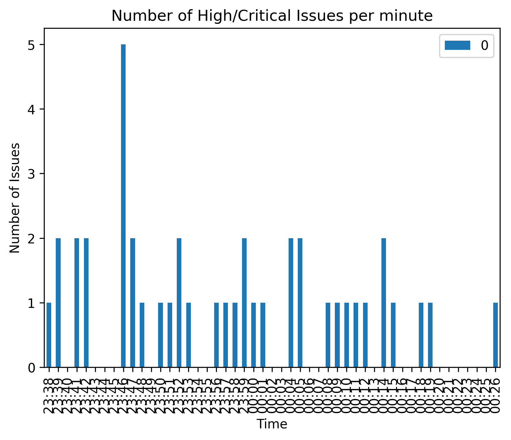

# Silk Home Assignment

## Setup

This application uses [python-poetry](https://python-poetry.org) for packaging, and dependency management.
Make sure you have it installed.

To install the application dependencies, run `poetry install` in the root of this project.

To activate the python environment with all the dependcies installed, run `poetry shell`.

All subsequent commands are assumed to be run inside that environment.

Dependencies are captured in the `pyproject.toml` file. Some intersting ones are:

* Python 3.11 - this is the version I use on my dev laptop.
* `atlassian-python-api` for interacting with Jira.
* `lorem` for generating random strings.
* `toml` for configuration format.
* `tinydb` for storing json as a db, since it claims to have API compatibility with Mongo, and for this small exercise, it is good enough.
* `pandas` and `matplotlib` for data manipulation and plotting.

## Running

All the programs have sensible defaults, and you have to set only the configruation. Copy `config.toml.sample`
to `config.toml` and set the values. The `project` key corresponds to the Jira Project.

The three functionalities are provided as three script entry points:

* [x] `poetry run gentickets` -- to create the the random tickets
* [x] `poetry run populatedb` -- to download the high priority tickets
* [x] `poetry run plottickets` -- to generate plot of high priority tickets/min

## Output

See [output/issues.json](output/issues.json) for a dump of the Jira issues my program created.

Plotted output

